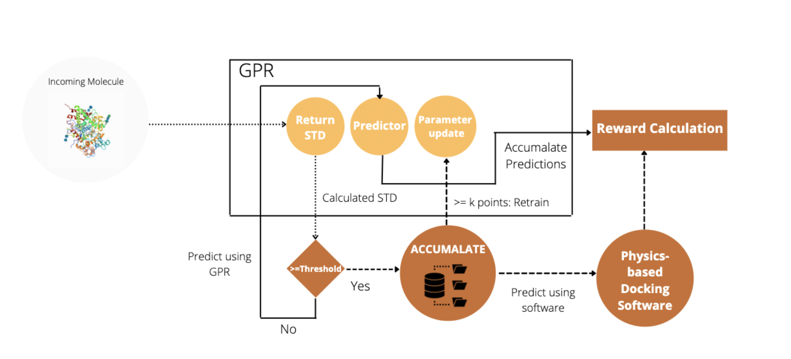

# Enhanced MoleGuLAR: Binding affinity predictions for enhanced molecular screening processes
The discovery of potential therapeutic agents for life threatening diseases has become an important problem. There is a requirement for fast and accurate methods that can identify drug-like molecules that can be used as potential candidates for novel targets. Existing methods like high-throughput screening and virtual screening are time-consuming and inefficient. Traditional molecule generation pipelines are more efficient than virtual screening, but use time consuming docking softwares. An alternative to this would be to have machine learning based docking functions which should be able to estimate the binding affinity with comparable accuracy and in a fraction of the time. In this study, we propose an active learning based model that can be added as a supplement to enhanced molecule generation architectures. The proposed method uses uncertainty sampling on the molecules created by the generator model and dynamically learns as the generator samples molecules from different regions of the chemical space. The proposed framework is able to generate molecules with high binding affinity with approx. 70% improvement in runtime compared to the baseline model by labelling only aprrox. 30% of molecules compared to the baseline oracle. 



This repository contains the code for optimization of the generator model using predictor machine learning models and docking calculations.
Installation
------------
[Install miniconda](https://docs.conda.io/en/latest/miniconda.html) and run the following command.

```conda env create --file environment.yml```

Running Experiments
--------------
To run the experiments that use AutoDock, AutoDock-GPU will have to be installed from [here](https://github.com/ccsb-scripps/AutoDock-GPU).
Mol2Vec must also be installed. The instructions for installation can be found [here](https://github.com/samoturk/mol2vec). The `gpr_pretrained.pkl` for the pipeline can be downloaded [here](https://iiitaphyd-my.sharepoint.com/:u:/g/personal/karthik_viswanathan_research_iiit_ac_in/EZj4SkuSsc9Fqj41zUC84AYBbhXyhtGrPtW_dsvSNDDJQg?e=l4w9KA) and the `gpr_al_inducted.pkl` can be downloaded [here](https://iiitaphyd-my.sharepoint.com/:u:/g/personal/karthik_viswanathan_research_iiit_ac_in/EQ4LkwsbvZxKjC6V0aVuh60BagYHgoyPFaEJYwS0MJnf6A?e=2a42dr)

After installing AutoDock-GPU, Open the `Optimizer` directory.

To run each of the experiments run the following commands
- Single Objective: Binding Affinity with TTBK1 using Active Learning + GPR

```python model_logP_QED_switch.py --reward_function exponential --num_iterations 100 --use_wandb yes --predictor dock --protein 4BTK --remarks <remarks>```

- Multi Objective : Binding Affinity with TTBK1 using Active Learning + GPR and target LogP = 2.5 (sum)

```python model_logP_QED_switch.py --reward_function exponential --num_iterations 100 --use_wandb yes --predictor dock --protein 4BTK --remarks <remarks> --logP yes --logP_threshold 2.5 --switch no```


Analysis
-----------
The `Analysis/Analysis.ipynb` notebook supports loading models optimized during each experiment and generating molecules.
The `Analysis/gpr.ipynb` shows the pre-training process of GPR before its induction into the pipeline along with the course correction before and after induction.
The `Analysis/al_random_comparison.ipynb` shows the comparison study between AL and random sampling
The `Analysis/molecules` folder contains all molecule files generated using the pipeline. They have been used in appropriate notebooks depending on their purpose in the study. 
